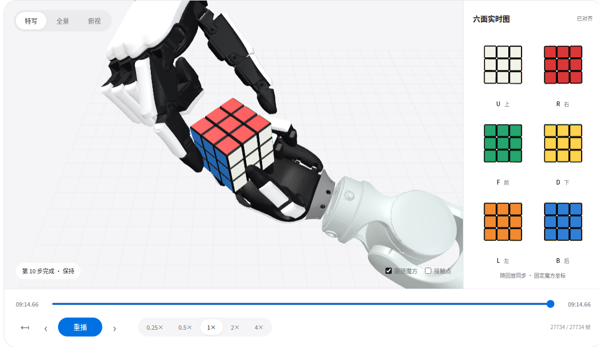

# xhand pro · Rubik’s Cube

**Marvin dual arms · Contact-driven simulation · Six live cube faces**

[**Open the interactive replay →**](https://evan715823.github.io/xhand-pro-cube-demo/)

Two 21-DOF xhand pro hands and two 7-axis Marvin arms complete a fixed-scramble solve in **554.66 s**. All ten moves are verified; final alignment error is **0.634°**. An independent fresh-state audit integrates all **554,660** physics steps.

The public site provides six synchronized orthographic cube views, 0.25×–4× playback, timeline seeking, move navigation, camera controls, and an embedded report download. It replays measured poses; it does not run MuJoCo in the browser.

## Hosting

GitHub Pages publishes the `main` branch at the repository root. The entry page is small; approximately **84.4 MB** of compressed recording data loads with progress feedback. The original gzip bytes are split into 11 checksum-verified parts and reconstructed without resampling.

This repository contains the public presentation assets. Full development code and numeric physics recordings remain in the separate research repository.

## Scope

This is a simulation of one fixed scramble from a calibrated grasp. It does not claim M7 integration, visual perception, tabletop pickup, or hardware readiness. Some hand-speed transients exceed URDF ratings; friction and contact parameters are not hardware-calibrated. Measurement details are available through “实验信息” and “下载报告” on the page.

## Rights and attribution

See [third-party notices](THIRD_PARTY_NOTICES.md) and [rights](LICENSE.md). Publishing the demonstration does not grant a blanket open-source license for company models.
